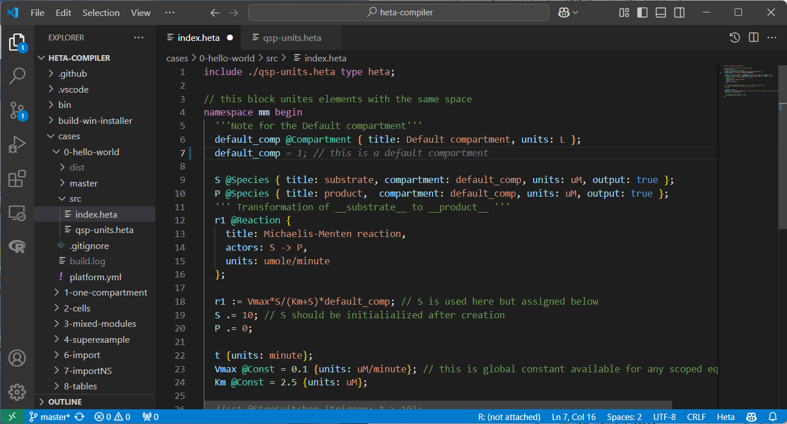
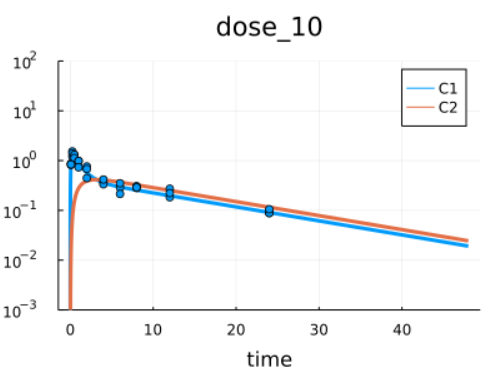
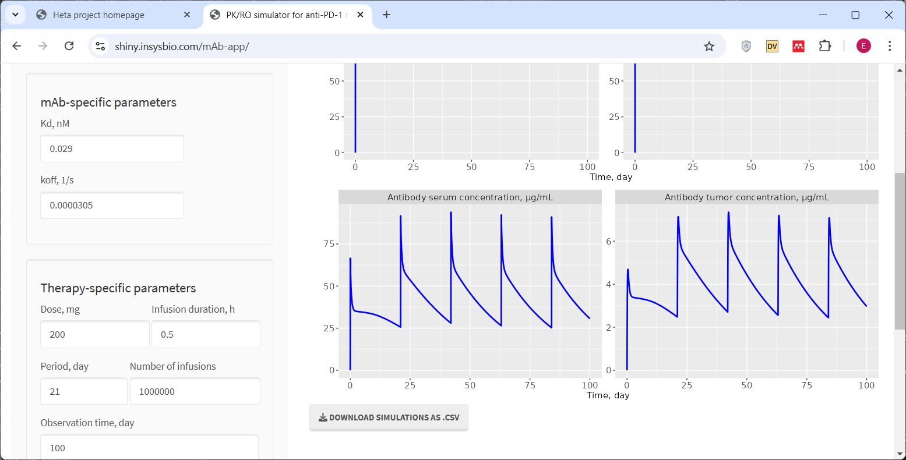
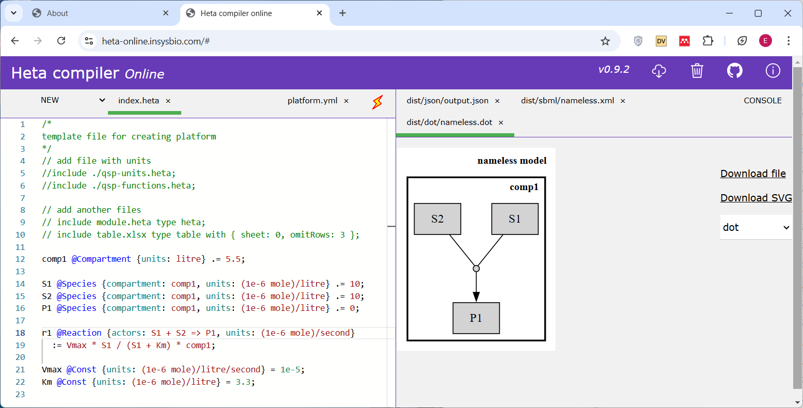
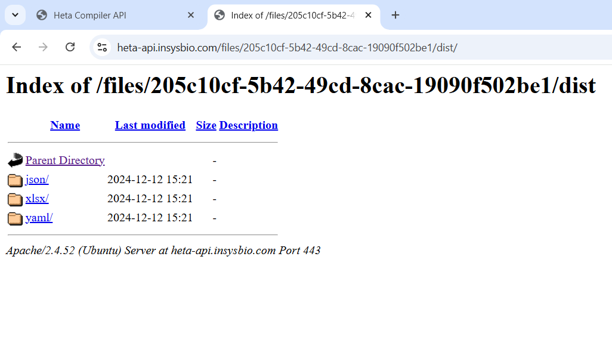
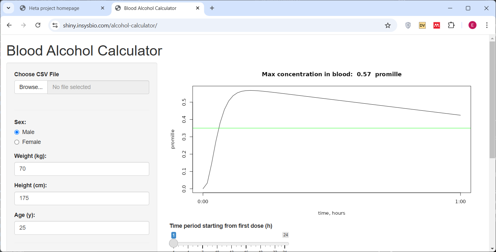
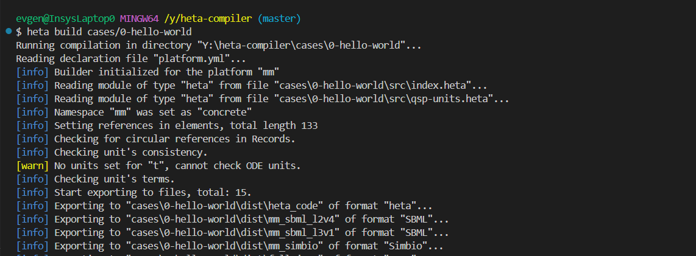
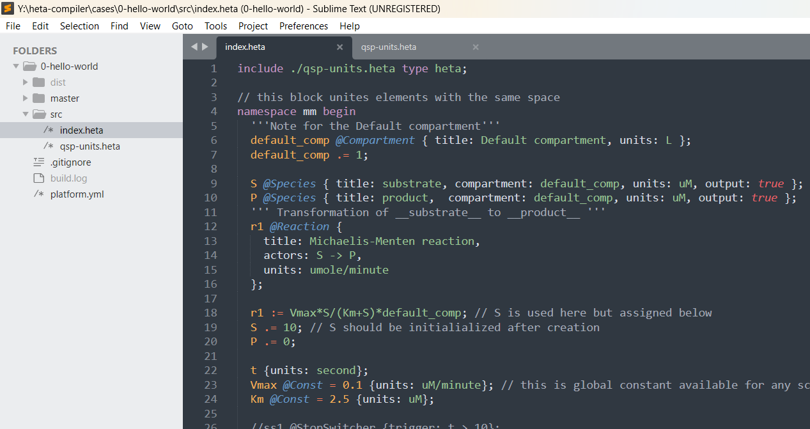

# Ecosystem

## Heta supporting tools

- Julia package for simulation of large scale QSP models supporting Heta syntax: [HetaSimulator.jl](https://github.com/hetalang/HetaSimulator.jl) 
- Command line tool compiling Heta and JS package: [heta-compiler](https://github.com/hetalang/heta-compiler) 
- Syntax highlighting for VSCode: [heta-highlight-vscode](https://github.com/hetalang/heta-highlight-vscode) 
- Syntax highlighting for Sublime text: [heta-highlight-sublime](https://github.com/hetalang/heta-highlight-sublime) 
- Parsing of Heta language code in JavaScript: [heta-parser](https://github.com/hetalang/heta-parser) 

## Web applications

Heta syntax and Heta infrastructure were utilized for the development of web-based tools.

- [Heta API](https://heta-api.insysbio.com/)
    A public API for Heta language compilation.
- [Heta compiler online](https://heta-online.insysbio.com/)
    Web based compiler and editor of Heta code.
- [SbmlViewer](https://sv.insysbio.com/)
    A tool for fast and easy reading of biological models written in SBML format. It allows you to open SBML in any browser.
- [Immune Response Template](https://irt.insysbio.com)
    A Quantitative Systems Pharmacology (QSP) platform of immune system and tool for development of QSP and mechanistic models related to immune response.
- [mAb-app](https://shiny.insysbio.com/mAb-app/)
    PK/RO simulator for anti-PD-1 monoclonal Antibodies (Shiny app)
- [ery](https://shiny.insysbio.com/ery/)
    PK/PD simulator for Erythropoiesis-Stimulating Agents (Shiny app)
- [sbml-mrgsolve-case](https://shiny.insysbio.com/sbml-mrgsolve-case/)
    An RMarkdown example demonstrating format conversion from SBML into mrgsolve

## Open source QSP platforms

The examples of Heta-based QSP platforms with CI/CD capabilities are shared on GitHub.

- [heta-case-mini](https://github.com/insysbio/heta-case-mini/)
    A demo example of QSP platform developed in the framework of Heta.
- [insulin-signaling-t2d](https://github.com/insysbio/insulin-signaling-t2d)
    Dynamic notebooks for QSP usage case: Insulin Signaling in Type 2 Diabetes
- [FAAH inhibitor model](https://github.com/insysbio/faah-inhibitor)
    A platform describing Fatty Acid Amide Hydrolase inhibition in human.
- [Drug Loaded Nanoparticles](https://github.com/insysbio/drug-loaded-nanoparticles)
    PBPK Modeling For Therapeutic Nanoparticles Loaded With Drug.
- [COVID-19 QSP model](https://github.com/insysbio/covid19-qsp-model)
    QSP model describing SARS-CoV-2 virus and host cell life cycles, immune response and therapeutic treatments
- [Alcohol PK](https://github.com/insysbio/alco)
    Simple model of alcohol PK build on published data
- [ANT model](https://github.com/insysbio/ant-mito-model)
    Adenine Nucleotide Translocase model reproduces from published resources

## QSP projects

The Heta language and Heta-based QSP framework were used in several “real world” projects for the development of middle-scale and large-scale models.

## Recommended Software for Working with Heta Models

To get started with Heta-based platforms, we recommend installing a minimal set of tools for full functionality. This setup ensures an efficient workflow, especially for medium- to large-scale QSP platforms. Usage of an Integrated Development Environment (IDE) is optional but highly beneficial.

For a guided introduction, check out the Heta tutorial's [Lesson #1](https://youtu.be/aIpo9Yksyb8).

### Minimal Recommended Setup

1. **VSCode**  
   - Download and Install: [https://code.visualstudio.com/](https://code.visualstudio.com/)  
   - Install with extensions manager: [Heta Highlight Plugin](https://marketplace.visualstudio.com/items?itemName=heta-highlight)

2. **heta-compiler**  
   - Installation Guide: [https://hetalang.github.io/#/heta-compiler/?id=installation](https://hetalang.github.io/#/heta-compiler/?id=installation)

3. **HetaSimulator**
    - Install Julia: [https://julialang.org/downloads/](https://julialang.org/downloads/)
    - Install the package: [https://hetalang.github.io/#/HetaSimulator.jl/](https://hetalang.github.io/#/HetaSimulator.jl/)

4. **Git** *(optional)*  
   - Download: [https://git-scm.com/](https://git-scm.com/)  
   - Provides Bash console and Git synchronization for version control.

### Alternative Configuration

If you prefer, you can use **Sublime Text** instead of VSCode:  
- Download and install: [https://www.sublimetext.com/download](https://www.sublimetext.com/download)  
- Install the **Heta highlighter plugin** via:  
  - Open `Package Control` > `Install Package` > Search for `Heta`.
