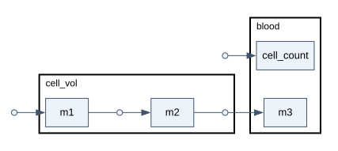
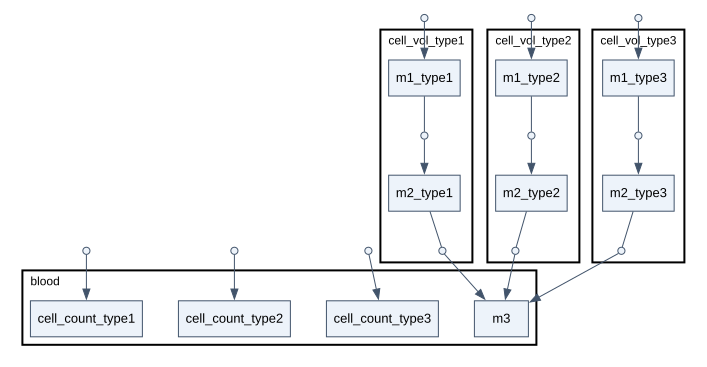
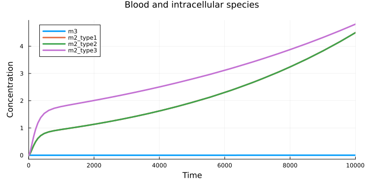

# Clone model components with #importNS

*This guide shows how to use `#importNS` to copy the same model components multiple times, rename them automatically, and connect them within one model.*

Describe a cell model once, then import its components for several cell types. Each copy can have its own parameter values while sharing selected components with the others.

Unlike [model variants](/how-to/model-variants/), the imported blocks become parts of **one model**. Each cell type has its own intracellular species and parameters, but all release a substance into the same blood pool.

Before you start, follow the [Quick start](/how-to/quick-start) to install heta-compiler, Julia, HetaSimulator, and Plots.

Create this directory and run all commands from it:

```text
clone-model-components/
├── cell-type.heta  # reusable cell model
├── index.heta      # imports and cell-type-specific changes
└── run.jl          # simulation
```

## Define the template

Create **cell-type.heta**:

```heta
namespace cell_template begin
  /* Cell proliferation and total cell volume. */
  blood @Compartment .= 5.3;
  cell_count @Species { compartment: blood } .= 1;
  v_prol @Reaction { actors: => cell_count } := k_prol * cell_count;
  k_prol @Const = 1e-3;
  cell_vol @Compartment := 1e-6 * cell_count;

  /* Intracellular synthesis, conversion, and transport to blood. */
  m1 @Species { compartment: cell_vol } .= 0;
  m2 @Species { compartment: cell_vol } .= 0;
  m3 @Species { compartment: blood, output: true } .= 0;

  vsyn_m1 @Reaction { actors: => m1 } := ksyn * cell_vol;
  v_m1_m2 @Reaction { actors: m1 => m2 } := kcat_m1 * m1 / (Km1 + m1) * cell_vol;
  vtr_m2 @Reaction { actors: m2 => m3 } := P * S * (m2 - m3);

  ksyn @Const = 1e-2;
  kcat_m1 @Const = 1e-1;
  Km1 @Const = 12;
  P @Const = 1.2;
  S @Const = 1e-8;
end
```

This small illustrative model describes one cell type. The substances `m1` and `m2` are inside the cells; `m3` is in blood.



## Import several cell types

Create **index.heta** with the complete content below:

```heta
include ./cell-type.heta;

/*
  Import all template components into nameless, the default namespace.
  suffix gives each cell type its own identifiers and updates references.
  rename keeps blood and m3 shared. Keep t unchanged for compiler 0.12.x.
*/
#importNS {
  fromSpace: cell_template, suffix: "_type1",
  rename: { blood: blood, m3: m3, t: t }
};

#importNS {
  fromSpace: cell_template, suffix: "_type2",
  rename: { blood: blood, m3: m3, t: t }
};

/* Type 3 uses the same structure but different parameter values. */
#importNS {
  fromSpace: cell_template, suffix: "_type3",
  rename: { blood: blood, m3: m3, t: t }
};
k_prol_type3 = 0.6e-3;
ksyn_type3 = 2e-2;
```

For example, `m2` becomes `m2_type1`, and its reaction references are renamed automatically. Explicit `rename` entries take priority over `suffix`: `m3` remains `m3`, so all three transport reactions feed the same species.

The parameter updates follow the third import and affect only that cell type. Leave out `@Const` when updating an existing constant.



## Build and inspect

Export all namespaces to SBML and DOT:

```bash
heta build --export="SBML,Dot"
```

The files appear in **dist/sbml/** and **dist/dot/** for both `cell_template` and the assembled model, `nameless`. DOT describes the model graph and can be displayed with a Graphviz viewer, as in the diagrams above.

## Simulate

Create **run.jl**:

```julia
using HetaSimulator, Plots

platform = load_platform(".")
model = models(platform)[:nameless]
scenario = Scenario(
  model, (0., 1e4);
  observables = [:m3, :m2_type1, :m2_type2, :m2_type3]
)
sim(scenario; abstol = 1e-9) |> plot
```



The small cell volumes require a tighter absolute solver tolerance (`abstol`) to avoid numerical artifacts in intracellular concentrations.

The `observables` option selects the shared blood species `m3` and `m2` from each cell type. Types 1 and 2 have identical parameters, so their `m2` curves overlap. Type 3 proliferates more slowly and synthesizes `m1` twice as fast, producing a higher intracellular concentration of `m2`. The much smaller concentration of `m3` keeps its curve close to the horizontal axis on this scale.

## Keep the template as your source

To add a cell type, add another import with a unique suffix. To change the shared structure, edit **cell-type.heta** and rebuild or reload the platform. Keep editing these source files rather than an exported table, so future changes still apply to every imported block.

Check the resulting model when choosing `rename`: matching identifiers can replace existing components. A short source file can also generate a large model; imports reduce repeated code, not the simulation workload.
