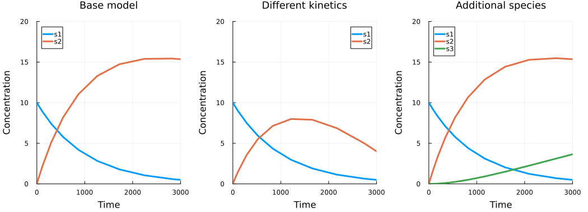

# Create model variants with Heta namespaces

*This guide shows how to reuse a base model, create two variants, and simulate them in one Heta platform.*

Instead of copying an entire model, include the same file in separate namespaces and describe only the changes. Each namespace produces an independent model.

Before you start, follow the [Quick start](/how-to/quick-start) to install heta-compiler, Julia, HetaSimulator, and Plots.

Create a directory named **model-variants**. In the steps below, you will add these files:

```text
model-variants/
├── base-model.heta  # shared model code
├── index.heta       # base model and namespace variants
└── run.jl           # simulations and plotting
```

Run all commands from this directory. Exported models will appear in **dist/**, and the Julia code will display the simulation plots.

## Define the base model

Create **base-model.heta**:

```heta
comp1 @Compartment .= 1;

s1 @Species { compartment: comp1 } .= 10;
s2 @Species { compartment: comp1 } .= 0;

r1 @Reaction { actors: s1 => 2 * s2 } := k1 * s1 * comp1;
r2 @Reaction { actors: s2 => } := k2 * s2 * comp1;

k1 @Const = 1e-3;
k2 @Const = 1e-4;
```

The model converts `s1` into `s2`, which is then removed. Both reactions use mass-action kinetics.

## Create the variants

Create **index.heta** in the same directory with the complete content below:

```heta
/*
  Base model: without an explicit namespace, components belong
  to the default namespace, nameless.
*/
include ./base-model.heta;

/*
  Variant 1: include the base model in its own namespace, then
  replace r2 with Michaelis-Menten kinetics and add its parameters.
  Deleting the unused k2 is optional. These changes affect only variant1.
*/
namespace variant1 begin
  include ./base-model.heta;

  r2 := Vmax * s2 * comp1 / (Km + s2);
  Vmax @Const = 5e-3;
  Km @Const = 1e-4;
  #delete k2;
end

/*
  Variant 2: add s3 as the product of r2 instead of removing s2
  from the system. Updating actors keeps the original rate expression.
*/
namespace variant2 begin
  include ./base-model.heta;

  s3 @Species { compartment: comp1 } .= 0;
  r2 { actors: s2 => s3 };
end
```

You now have three models: `nameless`, `variant1`, and `variant2`. Shared code stays in **base-model.heta**: after editing that file, rebuild or reload the platform to apply the changes to every model, followed by each variant's own updates.

## Build and export

Run from the project directory:

```bash
heta build --export=SBML
```

The compiler writes a separate SBML file for each namespace into **dist/sbml/**. To export only the two variants, use a namespace filter:

```bash
heta build --export="{format:SBML,spaceFilter:'variant1|variant2'}"
```

## Simulate the models

Create **run.jl** in the project directory and run it from there:

```julia
using HetaSimulator, Plots

platform = load_platform(".")
m0 = models(platform)[:nameless]
m1 = models(platform)[:variant1]
m2 = models(platform)[:variant2]

results0 = Scenario(m0, (0., 3000.); observables = [:s1, :s2]) |> sim
results1 = Scenario(m1, (0., 3000.); observables = [:s1, :s2]) |> sim
results2 = Scenario(m2, (0., 3000.); observables = [:s1, :s2, :s3]) |> sim

plot(
    plot(results0; title = "Base model"),
    plot(results1; title = "Different kinetics"),
    plot(results2; title = "Additional species");
    layout = (1, 3), ylims = (0, 20)
)
```



The first variant changes the dynamics of `s2`. In the second, `s1` and `s2` follow the same curves as in the base model, while the new species `s3` accumulates.

For more simulation examples, see the [HetaSimulator documentation](https://hetalang.github.io/HetaSimulator.jl/stable/).
