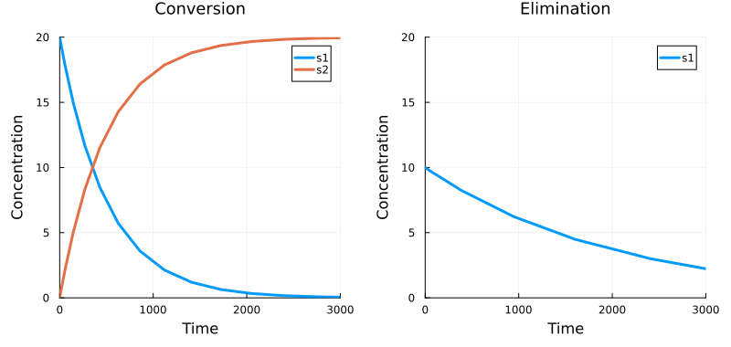

# Manage multiple Heta models

*This guide shows how to keep independent models in one platform and select them for export or simulation.*

Use a separate namespace for each model. Components can have the same names in different namespaces without referring to each other.

Before you start, follow the [Quick start](/how-to/quick-start) to install Heta-compiler, Julia, HetaSimulator, and Plots.

Create a directory named **multiple-models** with these files:

```text
multiple-models/
├── index.heta  # independent models and targeted updates
└── run.jl      # model selection, simulations, and plots
```

Run all commands from this directory.

## Define the models

Create **index.heta** with the complete content below:

```heta
/*
  Conversion model: s1 is converted into s2.
  All components in this block belong to conversion.
*/
namespace conversion begin
  comp1 @Compartment .= 1;
  s1 @Species { compartment: comp1, output: true } .= 10;
  s2 @Species { compartment: comp1, output: true } .= 0;
  r1 @Reaction { actors: s1 => s2 } := k1 * s1 * comp1;
  k1 @Const = 2e-3;
end

/*
  Elimination model: s1 is removed from the system.
  These comp1, s1, r1, and k1 are independent of those in conversion.
*/
namespace elimination begin
  comp1 @Compartment .= 5;
  s1 @Species { compartment: comp1, output: true } .= 10;
  r1 @Reaction { actors: s1 => } := k1 * s1 * comp1;
  k1 @Const = 1e-3;
end

/*
  Use space::id to update a component outside its namespace block.
  Each statement affects only the named model.
*/
conversion::s1 .= 20;
elimination::k1 = 5e-4;
```

The platform contains two independent models. For example, changing `elimination::k1` leaves `conversion::k1` unchanged. References such as `s1` in a reaction's rate resolve within that reaction's namespace.

Components belong to individual namespaces; user-defined functions and units are shared across the platform. Components defined outside a namespace block belong to `nameless` unless you specify `space::id`, as in the updates above.

## Select models for export

Export all namespaces to SBML:

```bash
heta build --export=SBML
```

The compiler creates **conversion.xml** and **elimination.xml** in **dist/sbml/**, plus **nameless.xml** for the empty default namespace. To export only the conversion model, use `spaceFilter`:

```bash
heta build --export="{format:SBML,spaceFilter:'conversion'}"
```

The filter matches namespace names using a regular expression. Previously exported files remain in **dist/**.

## Select models for simulation

Create **run.jl** and run it from the project directory:

```julia
using HetaSimulator, Plots

platform = load_platform(".")
conversion = models(platform)[:conversion]
elimination = models(platform)[:elimination]

Scenario(conversion, (0., 3000.)) |> sim |> plot
Scenario(elimination, (0., 3000.)) |> sim |> plot

```



Select each model by its namespace name. Species marked with `output: true` are plotted automatically. Here, `s2` exists only in `conversion`. In both plots, `s1` refers to the species in the selected model.

If your models share a common base, see [Create model variants with Heta namespaces](/how-to/model-variants/).
