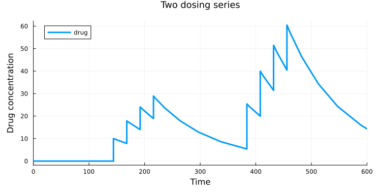

# Simulate repeated dosing

*This guide shows how to schedule repeated doses with `TimeSwitcher` and simulate two dosing series separated by a treatment break.*

Use one switcher for each series. At every scheduled time, an event adds a dose to the drug already present in the compartment.

Before you start, follow the [Quick start](/how-to/quick-start) to install Julia, HetaSimulator, and Plots.

Create this directory with two files:

```text
repeated-dosing/
├── index.heta  # elimination model and dosing events
└── run.jl      # simulation and plot
```

## Define the dosing schedule

Create **index.heta** with the complete content below:

```heta
/* A simple one-compartment model with first-order drug elimination. */
central @Compartment .= 1;
drug @Species { compartment: central, output: true } .= 0;
elimination @Reaction { actors: drug => } := k_elim * drug * central;
k_elim @Const = 1e-2;

/*
  First series: four doses of 10 at times 144, 168, 192, and 216.
  Add dose / volume to the current concentration at each event.
*/
series1 @TimeSwitcher { start: 144, period: 24, stop: 216 };
dose1 @Const = 10;
drug [series1]= drug + dose1 / central;

/* Second series: four doses of 20 after a treatment break. */
series2 @TimeSwitcher { start: 384, period: 24, stop: 456 };
dose2 @Const = 20;
drug [series2]= drug + dose2 / central;
```

`start` is the first dosing time, `period` is the interval between doses, and `stop` limits the series. Here, `stop` falls on a scheduled time, so that last dose is included:

| Series | Dosing times | Dose |
| --- | --- | --- |
| `series1` | 144, 168, 192, 216 | 10 |
| `series2` | 384, 408, 432, 456 | 20 |

The assignment `drug [series1]= ...` runs whenever `series1` fires. Because `drug` is a concentration and `dose1` is an amount, divide the dose by the compartment volume. Keep `drug +` on the right-hand side to add the dose rather than replace the current concentration.

This illustrative model uses arbitrary consistent units. Between doses, the drug is removed by the elimination reaction; no doses occur during the break between the two series.

## Simulate the model

Create **run.jl**:

```julia
using HetaSimulator, Plots

platform = load_platform(".")
model = models(platform)[:nameless]
Scenario(model, (0., 600.)) |> sim |> plot
```

Run the file in Julia. The simulation covers both series and the decline after the last dose. `output: true` selects the drug concentration for plotting.



Each dose produces an immediate concentration increase, followed by elimination. Repeated doses accumulate, and the second series uses twice the dose of the first.

## Change the regimen

Change `start`, `period`, and `stop` to move or extend a series, and change `dose1` or `dose2` to adjust its dose. Add another `TimeSwitcher` and event assignment for a third series. Then reload the platform and rerun the simulation.
