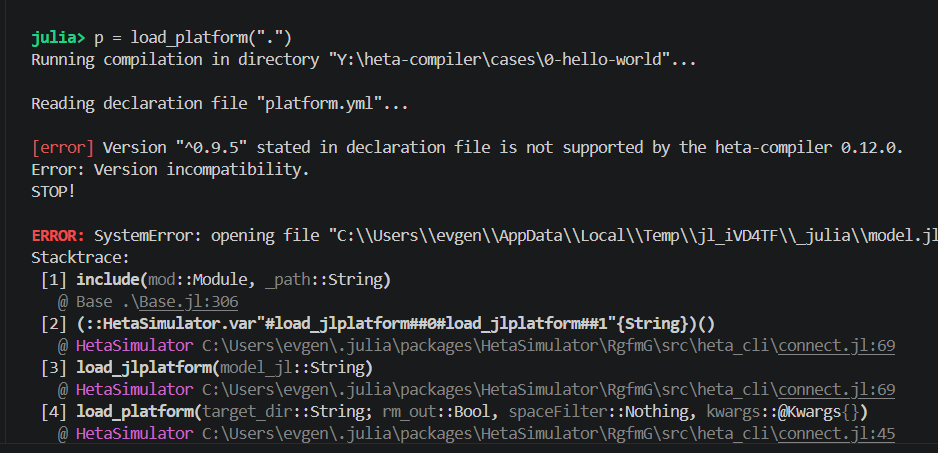
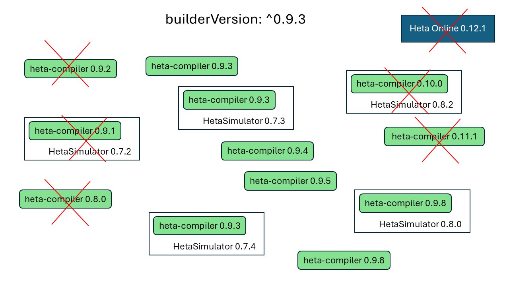

# Manage software versions

*This guide explains how to choose compatible compiler and simulator versions, share models safely, and keep archived projects reproducible.*

## The problem

A model may build correctly today but fail tomorrow when you open old code or move to another computer. You may see an error saying that the model is not compatible with the installed compiler.



Sometimes the model builds with `heta-compiler` but fails in HetaSimulator if versions are incompatible.

## Why Heta checks versions

The Heta format changes over time. New releases add features, improve performance, and fix errors. At the same time, an existing model should continue to produce predictable results.

It is not possible to guarantee that every model works with every combination of compiler and simulator versions. Heta therefore checks versions before building a model.

Without these checks, two colleagues can get different results from the same project. For example, Anton creates a model with `heta-compiler` `0.11.1`, while Boris uses HetaSimulator `0.7.5`, which contains compiler `0.9.4`. Boris may:

- get build errors that Anton does not see;
- change the model to remove those errors, causing it to fail for Anton;
- build the model successfully but get different simulation results.

The team could keep one old software version forever, but then it would miss new features and bug fixes. A better solution is to record which compiler versions are compatible with the model.

## Versions you need to know

- **Model version** identifies a release of your model. Set it with `version` in **platform.yml**, for example `version: 0.1.0`.
- **heta-compiler version** identifies the compiler used to build the model, for example `0.12.1`. Run `heta --version` to check it.
- **HetaSimulator.jl version** identifies the simulator release, for example `0.8.3`. Run `] status HetaSimulator` in Julia to check it.

The model version tracks changes in your project. The other two versions describe the software used to build and simulate it.

## How `builderVersion` protects a project

Set the supported compiler range in **platform.yml**:

```yaml
{
  builderVersion: "^0.12.0",      // this is the compiler version range
  id: "my_project",
  notes: "My project description",
  version: "0.1.0",               // this is the model version
  license: "MIT",
  options: {...},
  importModule: {type: "heta", source: "src/index.heta"},
  export: [...]
}
```

Version checks then work as follows:

1. `heta-compiler` checks whether its version is inside the `builderVersion` range. If it is not, the build stops with an error.
2. HetaSimulator and other Heta tools compare the range with the compiler version included in that tool. They also stop if the versions do not match.
3. Heta developers try to keep new releases compatible. Possible compatibility changes are reflected in the compiler version and described in the changelog.

This lets you limit a project to compiler versions that you trust or have tested. To use a compiler outside that range, migrate the model, test it, and then update `builderVersion`.

`builderVersion` prevents the project from running with undeclared compiler versions. It does not prove that every simulation result will be identical.

## Choose a compiler range

Heta uses [Semantic Versioning](https://semver.org/) and [npm-style version ranges](https://docs.npmjs.com/cli/v6/using-npm/semver/). The most useful ranges are:

| Value | Meaning |
| --- | --- |
| `0.11.1` | Only compiler `0.11.1` is allowed. |
| `^0.11.1` | Versions from `0.11.1` up to, but not including, `0.12.0` are allowed. For example, `0.11.2` and `0.11.5` are allowed. |
| `*` | Every compiler version is allowed. Avoid this value because it disables useful protection. |



`heta init` adds `builderVersion: "^0.12.0"` to a new **platform.yml**.

Use a caret range such as `^0.12.1` when the model has been tested with `0.12.1` and may use later compatible patch releases. Use an exact value such as `0.12.1` when you need to lock the project to one tested compiler version.

## Check compiler and simulator compatibility

Use the [compatibility table](/resources/compatibility) to find which compiler is included in each HetaSimulator release.

For example, if your project supports compiler `0.11.1`, choose a HetaSimulator release that includes compiler `0.11.1`. Install a specific simulator version in Julia with:

```julia
] add HetaSimulator@0.8.3
```

## Share a model with a colleague

Suppose Anton creates and tests a model with `heta-compiler` `0.11.1`. The project contains `builderVersion: "^0.11.0"`, so that compiler is allowed.

1. Anton sends the complete project, including **platform.yml**, to Boris.
2. Boris tries to build it with compiler `0.12.1`. The compiler stops because `0.12.1` is outside the declared range.
3. Anton and Boris choose one of two options:
   - **Keep the current range.** Boris installs a compiler inside `^0.11.0`, such as `0.11.1`.
   - **Move to a new range.** They update the model using the [`0.12` migration guide](https://hetalang.github.io/hetacompiler/migrate/migrate-to-v0.12), test it with the new compiler, and update model `version`.
4. They use the [compatibility table](/resources/compatibility) to install a HetaSimulator release with a compiler inside the chosen range.
5. They commit the updated model and **platform.yml** so that everyone uses the agreed range.

## Open an archived model

Suppose Anton finds an old project with `builderVersion: "^0.9.0"`, but his installed compiler is `0.12.1`.

1. Do not change `builderVersion` immediately. First check whether the archived model still works in its original range.
2. Find the newest matching compiler in the [compatibility table](/resources/compatibility). For `^0.9.0`, this could be `0.9.8`.
3. Download that compiler from the [heta-compiler releases](https://github.com/hetalang/heta-compiler/releases) and build the model.
4. If simulations are required, install the matching HetaSimulator version. Compiler `0.9.8`, for example, is included in HetaSimulator `0.8.0`.
5. After checking the model, either keep the old range or migrate it. To migrate, apply the relevant guides for [`0.10`](https://hetalang.github.io/hetacompiler/migrate/migrate-to-v0.10), [`0.11`](https://hetalang.github.io/hetacompiler/migrate/migrate-to-v0.11), and [`0.12`](https://hetalang.github.io/hetacompiler/migrate/migrate-to-v0.12), then update `builderVersion` and test again.
6. Save the migrated project as a new model version.

## Prepare a reproducible release

For maximum reproducibility, use the exact compiler version on which the final model was tested. For example:

```yaml
builderVersion: "0.12.1"
```

Keep this setting in the delivered or archived **platform.yml**. Also record the compatible HetaSimulator version when simulation results are part of the delivery.

## Keep version management simple

For modelers:

- Agree on a compiler range for the whole team (or particular platform), for example `^0.12.0`.
- Install compiler and simulator versions that match that range. You can take newer releases only while they remain inside it.
- Migrate reused models to the team's range before starting new work, then save them as a new model version.
- If you work mainly in Julia, consider [building with HetaSimulator](/how-to/build-heta-in-julia/). This can make it easier to use different compiler versions in different Julia environments.

Heta developers aim to:

- change the compiler's major version no more than once a year;
- release `0.13.x`, but not `0.14.x`, during 2026–2027;
- support the previous compiler and simulator series for at least one year after a new series is released. This includes support for `0.12.x` during 2026–2027.
