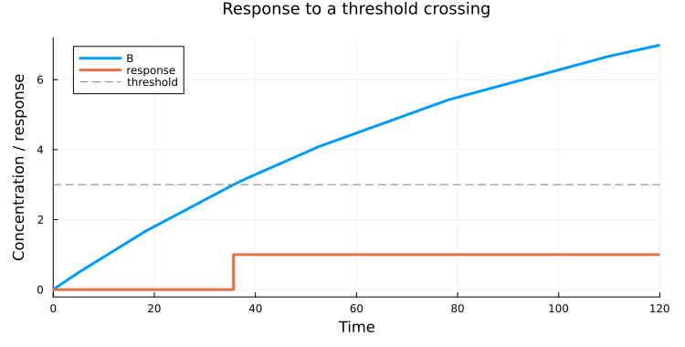
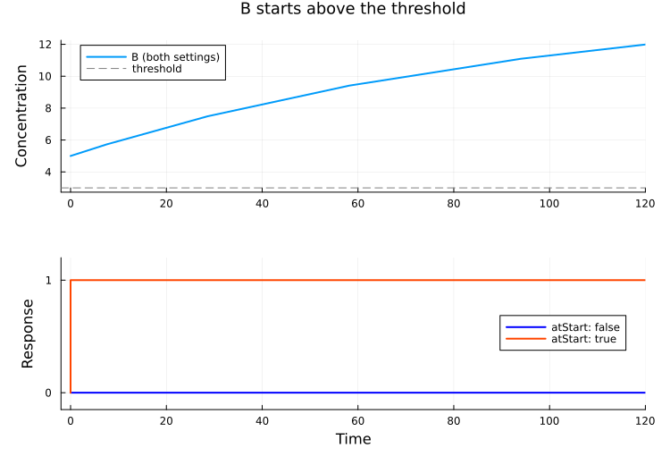

# Trigger events at a threshold

*This guide shows how to use `CSwitcher` to change a model variable when a concentration crosses a threshold.*

Unlike [scheduled dosing](/how-to/repeated-dosing/), a threshold event has no predefined time: it depends on the simulated state of the model.

Before you start, follow the [Quick start](/how-to/quick-start) to install Julia, HetaSimulator, and Plots.

Create this directory with two files and run the example from it:

```text
threshold-events/
├── index.heta  # conversion model and threshold event
└── run.jl      # simulation and plot
```

## Define the event

Create **index.heta** with the complete content below:

```heta
/* A is converted into B in a compartment of constant volume. */
cell @Compartment .= 1;
A @Species { compartment: cell } .= 10;
B @Species { compartment: cell, output: true } .= 0;
conversion @Reaction { actors: A => B } := k * A * cell;
k @Const = 1e-2;

/*
  Switch the response on when B rises through the threshold.
  The trigger must cross zero from negative to positive.
*/
threshold @Const = 3;
response @Record { output: true } .= 0;
threshold_reached @CSwitcher {
  trigger: "B - threshold",
  atStart: false
};
response [threshold_reached]= 1;
```

As `A` is converted into `B`, the concentration of `B` rises. `CSwitcher` locates the zero of `B - threshold` as it crosses from negative to positive. The event assignment then changes `response` from 0 to 1. This record stores a simple on/off indicator; it does not affect the reaction.

The response remains 1 after the event. An event assignment is not a continuously evaluated rule and does not automatically reset when the concentration falls.

## Simulate the model

Create **run.jl**:

```julia
using HetaSimulator, Plots

platform = load_platform(".")
model = models(platform)[:nameless]
Scenario(model, (0., 120.)) |> sim |> plot
```

Run the file in Julia. Both `B` and `response` are plotted because they have `output: true`.



The response changes at approximately `t = 35.7`, when `B` reaches 3. The dashed threshold line is added to the illustration for reference.

## Choose the crossing direction

Use `B - threshold` to detect a rising concentration. For a falling concentration, use `threshold - B`: it becomes positive when `B` falls below the threshold. `CSwitcher` detects a negative-to-positive crossing of the expression, not both directions.

## Handle the initial state

`atStart` controls whether the event can run immediately when its trigger is already nonnegative at the start. Its default is `false`.

For example, change the initial value of `B` to 5 in **index.heta** and reload the platform. With `atStart: false`, the response stays 0: `B` starts above the threshold and keeps rising, so there is no crossing. With `atStart: true`, the response becomes 1 immediately.



In the original example, `B` starts below the threshold, so either setting waits for the same crossing.
