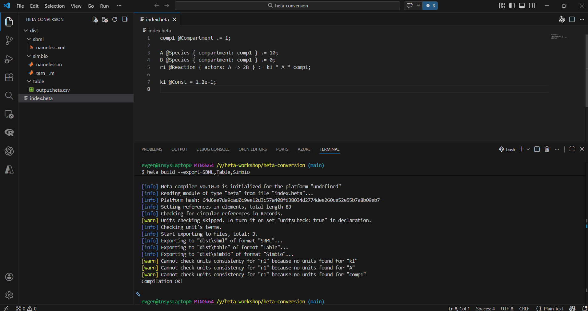
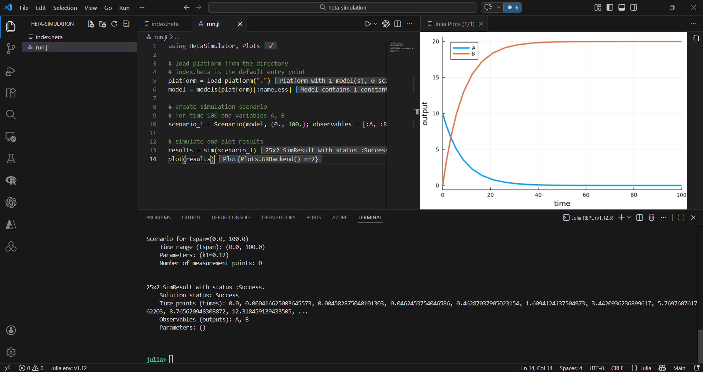

# Quick start

Heta models can be used in two main workflows:

1. Compile models and export them to different formats
2. Run simulations using HetaSimulator

## Quick start: conversion

Before you start, make sure you have [installed the following](/ecosystem#recommended-software-for-working-with-heta-models):

- VSCode
- Heta-compiler

__What we will build__

In this quick start we create a **simple reaction model** and convert it to SBML, Simbiology, and Heta-Table format.

### Step 1

Create a new directory called `heta-conversion` and open it in VSCode (drag-and-drop the directory to the __Code__ icon).

### Step 2

Create a file `index.heta` inside the directory with the following content:

```heta
comp1 @Compartment .= 1;

A @Species { compartment: comp1 } .= 10;
B @Species { compartment: comp1 } .= 0;
r1 @Reaction { actors: A => 2B } := k1 * A * comp1;

k1 @Const = 1.2e-1;
```

This model describes a simple reaction converting A to B inside a compartment.

### Step 3

Open the terminal in VSCode (Terminal -> New Terminal or __Ctrl + `__) and run the following command in the project directory:

```bash
heta build --export=SBML,Table,Simbio
```

Open the `dist` directory in VSCode and inspect the generated files.



### Next steps

- [Heta-compiler documentation](/hetacompiler/)

## Quick start: simulation

Before you start, make sure you have [installed the following](/ecosystem#recommended-software-for-working-with-heta-models):

- VSCode
- Julia
- Julia extension for VSCode
- HetaSimulator.jl package
- Plots.jl package

__What we will build__

In this quick start we create a **simple reaction model** and plot the simulation results.

### Step 1

Create a new directory called `heta-simulation` and open it in VSCode (drag-and-drop the directory to the __Code__ icon).

### Step 2

Create a file `index.heta` inside the directory with the following content:

```heta
comp1 @Compartment .= 1;

A @Species { compartment: comp1 } .= 10;
B @Species { compartment: comp1 } .= 0;
r1 @Reaction { actors: A => 2B } := k1 * A * comp1;

k1 @Const = 1.2e-1;
```

This model describes a simple reaction converting A to B inside a compartment.

### Step 3

Create a file `run.jl` with the following content:

```julia
using HetaSimulator, Plots

# load platform from the directory
# index.heta is the default entry point
platform = load_platform(".")
model = models(platform)[:nameless] # default model in platform

# create simulation scenario 
# for time 100 and variables A, B
scenario_1 = Scenario(model, (0., 100.); observables = [:A, :B])

# simulate and plot results
results = sim(scenario_1)
plot(results)
```

Run the code line by line pressing __Ctrl + Enter__



### Next steps

- [HetaSimulator.jl documentation](https://hetalang.github.io/HetaSimulator.jl/stable/)