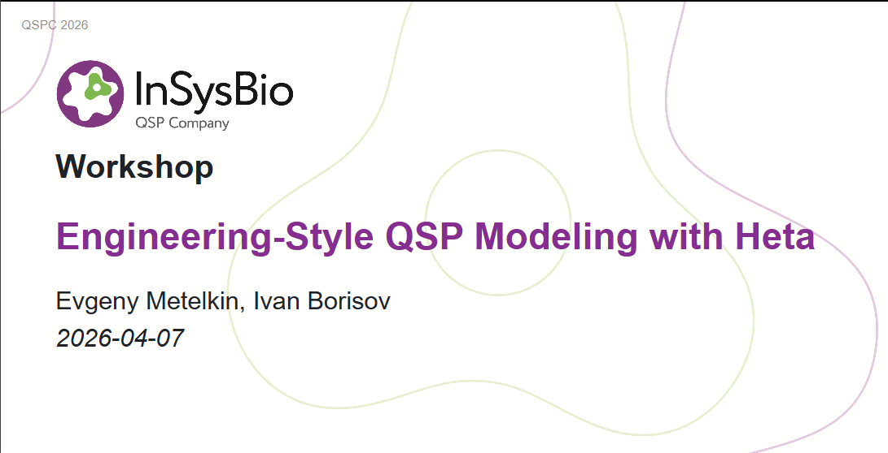

# Learn Heta

*This section provides tutorials and video presentations to help you get started with Heta language and its features.*

## Workshop: Engineering-Style QSP Modeling with Heta

Workshop for a 3 hour tutorial on Heta workflow and features, presented at QSPC2026.

[SLIDES](https://hetalang.github.io/qspc2026/)

## Heta Video Tutorial (2021)

Short screencast videos 10-20 minutes explaining Heta features with examples.

**[Watch on YouTube](https://www.youtube.com/playlist?list=PLUBqQmGMDNHLtHM4DaflBi3TzF3_rZpsj)**

- **Lesson 0. Introduction.** *QSP. Heta language. Compiler. About tutorial.*
- **Lesson 1. Preparation.** *Heta compiler. Software installation. VSCode. Code highlights. Console. “Hello World!” model.*
- **Lesson 2. Syntax.** *Data types. Heta statements. #insert action. Properties. "One compartment PK" model. Plain vs shortened form.*
- **Lesson 3. Components. Assignments.** *"ODE" vs "Process-description". Const. Record. Process. "Tanks and pipes" model.*
- **Lesson 4. Compartment. Species. Reaction.** *Biological meaning. Properties. Multi-compartment model. ODEs for Species.*
- **Lesson 5. Updating components.** *Insert. Update. Delete. Remarks. Restyling of multi-compartment model.*

<iframe width="560" height="315" src="https://www.youtube.com/embed/I60hpGHNoLU" frameborder="0" allow="accelerometer; autoplay; clipboard-write; encrypted-media; gyroscope; picture-in-picture" allowfullscreen></iframe>

## Video Presentations

### Heta language: Modularity and Reusability in QSP modeling platforms

*American Conference on Pharmacometrics. November 9-13, 2021*

<iframe width="560" height="315" src="https://www.youtube.com/embed/boJAMjh7EQY" frameborder="0" allow="accelerometer; autoplay; clipboard-write; encrypted-media; gyroscope; picture-in-picture" allowfullscreen></iframe>

### Heta compiler is a framework for the development and management of Quantitative Systems Pharmacology modeling platforms

*American Conference on Pharmacometrics. November 9-13, 2020*

<iframe width="560" height="315" src="https://www.youtube.com/embed/LdNh7Pj9RTM" frameborder="0" allow="accelerometer; autoplay; clipboard-write; encrypted-media; gyroscope; picture-in-picture" allowfullscreen></iframe>
